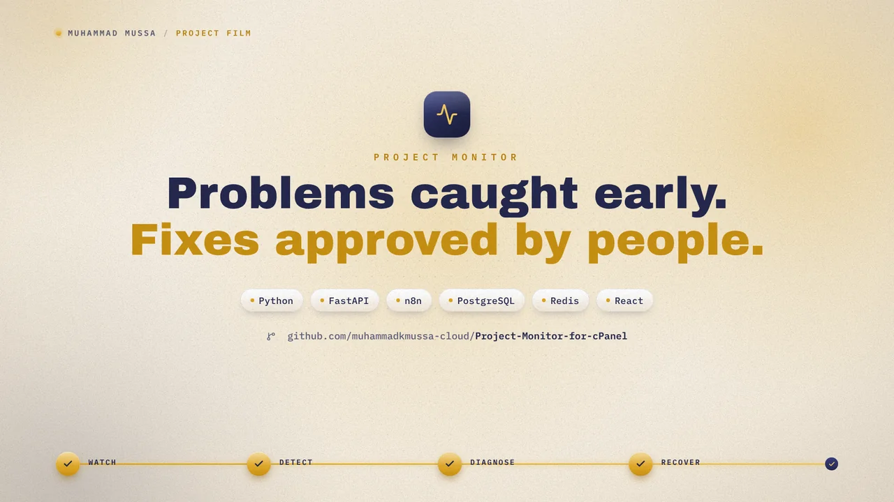

# Project Monitor

https://github.com/user-attachments/assets/1f5a13db-0da5-45c8-83d5-f015f6320624

[](https://github.com/user-attachments/assets/1f5a13db-0da5-45c8-83d5-f015f6320624)

AI-powered multi-project website and application monitoring platform.

## Overview

A centralized monitoring supervisor that continuously watches registered websites and applications, detects incidents, uses AI for diagnosis, and provides controlled remediation capabilities.

## Architecture

- **n8n**: Workflow automation (port 5678)
- **Monitoring Agent**: Python/FastAPI REST API (port 8080)
- **Frontend**: React + Vite dashboard (port 3005)
- **PostgreSQL**: Data storage (port 25432)
- **Redis**: Caching and rate limiting (port 26379)
- **Nginx**: Reverse proxy with SSL (production only, ports 80/443)

## Quick Start

```bash
# Clone and setup
cd project_monitor
cp .env.example .env
# Edit .env with your configuration

# Start services
bash scripts/start.sh

# Verify
curl http://localhost:8080/health
```

## Services

| Service | Port | Description | Health Check |
|---------|------|-------------|--------------|
| PostgreSQL | 25432 | Database | pg_isready |
| Redis | 26379 | Cache | redis-cli ping |
| Monitoring Agent | 8080 | REST API | curl /health |
| Frontend | 3005 | React Dashboard | curl / |
| n8n | 5678 | Workflow Automation | wget /healthz |

## Administrator setup

Existing installations keep their accounts. On a new installation, create the
first administrator interactively after starting the services:

```bash
docker compose exec monitoring-agent python -m app.bootstrap_admin
```

There is no built-in administrator password. Login accepts a JSON body at
`POST /api/v1/auth/login` with `email` and `password` fields. API requests use a
Bearer token or an API key. Tenant accounts can read their own monitoring data;
platform administration, SSH operations, and changes require an admin/owner.

## Key Features

- Multi-project monitoring (websites, APIs, servers)
- AI-powered incident diagnosis (DeepSeek integration)
- Controlled remediation with human approval
- Telegram, Email, and Slack notifications
- Real-time health monitoring
- Billing and usage tracking
- RBAC (admin/user roles)
- Self-monitoring of platform health

## Documentation

- [Architecture](docs/architecture.md)
- [Local Setup](docs/local-setup.md)
- [Telegram incident reviews](docs/telegram-reviews.md)
- [Environment Variables](docs/environment-variables.md)
- [Oracle Cloud Deployment](docs/oracle-deployment.md)
- [API Reference](docs/api-reference.md)

## Production Deployment (Oracle Cloud)

```bash
# Copy production env
cp .env.production.example .env.production
# Edit .env.production with real secrets

# Deploy
docker compose --env-file .env.production -f docker-compose.production.yml up -d

# Setup SSL
./scripts/setup-ssl.sh your-domain.com admin@email.com

# Setup automated backups
crontab -e
# Add: 0 2 * * * /opt/project-monitor/scripts/backup-db.sh
```

## License

Internal use only.

